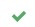

 
## Are My Standards Too Low?
Throughout my whole programming career, I have never heard of coding standards.  I did not know that they existed or the importance of them.  Although, I do understand the importance of certain standards such as spacing.  My first programming language was Python back in high school.  This language does not use curly braces or “begin” and “end” keywords.  Instead, it uses spaces and indentation.  This means that it was very important to pay attention to the white space.  I feel like this sense of uniform spacing that was ingrained in me helped me create some sort of standard.

Coding standards are actually very useful because they help with readability across all code no matter who wrote them because it all looks the same.  Standards also help you easily find mistakes since they will stick out more.  In order to enforce these rules, you need a tool to look for errors.  There are many different resources out there that can detect where your code does not conform to the coding standards.  In my ICS 314 class, we started using the IDE (integrated development environment) IntelliJ IDEA.  With this, you can set up ESLint which is a tool to enforce coding standards.

## Tedious But Helpful
So far, we have been using ESLint for a week.  I find it a little tedious because of the need for extra spacing that I did not think was important.  Sometimes it feels a bit daunting when I write my program and there are a lot of errors.  However, I enjoy the way IntelliJ will give suggestions on what is wrong.  There is even a button you can press where it will fix it automatically.  Even though there is that option, I usually like to figure out how to fix it myself first.  Otherwise, I will never learn.  

## Give Me the Green Light

The green check mark at the top right corner of my code makes me feel great now.  At first I thought it was unnecessary to go through making everything conform to the standards.  However, after having some experience with it, I know that it makes everything cleaner and easier to debug.  Everyone should find a tool to enforce coding standards and use it with everything they program.
