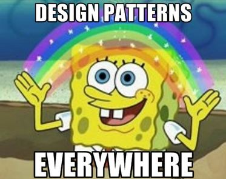
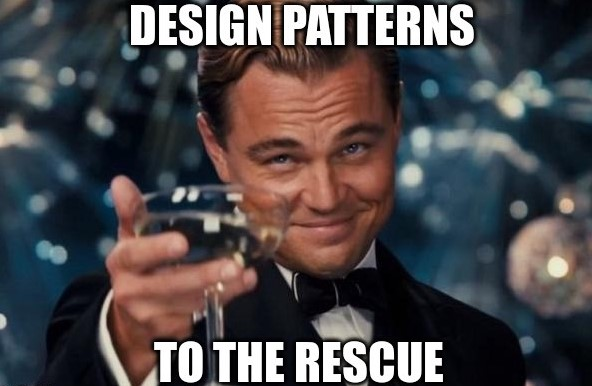

## Design Me a Pattern
Design patterns are used throughout software engineering.  They are general reusable solutions that arise from common recurring problems.  In other words, they are templates that can be used in many different situations.  Each design pattern has a name, problem description, solution description, and consequences to fully describe them.  Let us take a look at the most common design patterns: factory, singleton, observer, and model-view-controller.  We will also see how these patterns are used throughout my ICS 314 project: [Manoa Eateries](https://manoa-eateries.github.io/).

## Building A Factory
The factory design pattern creates objects without showing the underlying logic.  It can return objects associated with different classes and create dependent objects.  This is similar to the Object Oriented class constructor but it allows for a lot more flexibility.  In my project, we have a simple schema for the UserProfilesCollection that describes what parts should be in a user profile.

## Singled Out
The singleton design pattern provides a global variable in an object oriented language that does not actually support global variables.  It is easy to implement but beware of using it because sometimes using global state is unwise.  In Manoa Eateries, you can see that we have a class VendorProfilesCollection which manages access to the MongoDB collection VendorProfilesCollection.  We made a variable VendorProfiles which is a singleton instance of the VendorProfilesCollection class.

## Be Observant
Furthermore, we have the observer design pattern which has a set of objects that need to be informed when another object has a change in state.  There are two other design patterns that fall under this: publish-subscribe and reactive data.  Publish-subscribe is already built into Meteor with the concept of publishing and subscribing.  There are senders, called publishers, that have classes to carry messages without knowledge of what subscribers will be receiving the information.  For example, in my project we publish VendorProfiles and then we can subscribe to that in the ListVendorProfiles.jsx page.  This allows us to always display current information.  While publishing VendorProfiles, you can also see an example of reactive data.  This publication uses the .find() function on the VendorProfiles collection.  So, whenever information in the collection changes, this function reruns.

## Model For Me
Lastly, the model-view-controller design pattern is often used when implementing a user interface.  You want to make sure that the user can only see certain information.  It separates the model from the view.  In other words, this design pattern creates a separation between the database and what the user can see.  In our case, we have the model as MongoDB.  The Router is the controller like in our App.jsx where different routes are defined based on the logged in user.  Then, the view is described using React.

## Can’t Have Enough

As you can see, design patterns are important and widely used throughout software engineering.  They are helpful in finding solutions to common problems.  There are so many more design patterns out there so any coder can find one to solve their issues.
