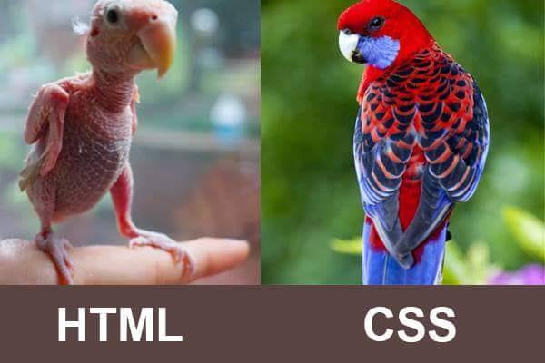
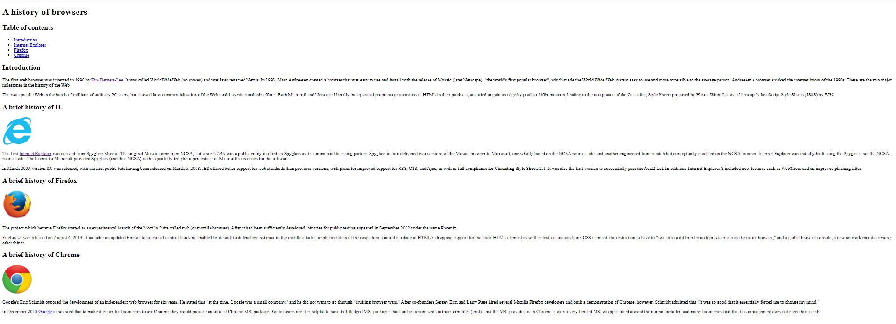
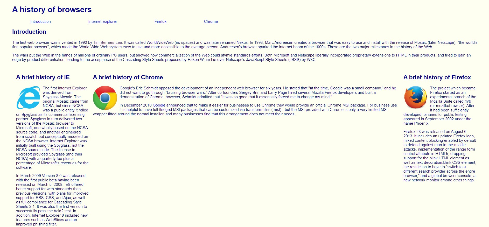
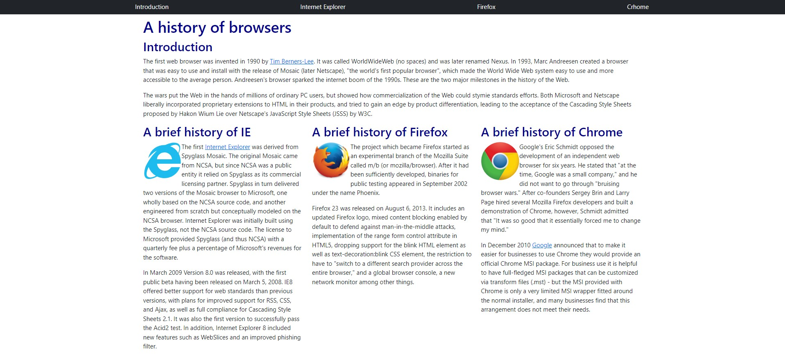
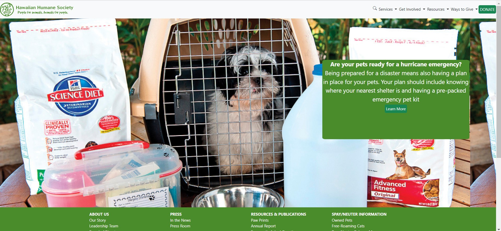

## What even is a UI Framework?
A UI framework is basically a set of classes you can use in your html to create an aesthetic website.  These classes have styling associated with them already so you do not have to do much styling yourself.  Once you learn how to utilize the classes that come in a framework, it becomes much easier to create an easy to read and pretty website.

## My Experience with Bootstrap 5
So far I have been using the framework Bootstrap 5 in order to create websites for about a week.  Before that, I was just using html and css and it definitely has its limitations.  At first, I thought it would be really easy to use to make good looking websites.  However, it takes time to read the documentation and learn what classes are even available.  In order to use a framework to its full potential, you need to be familiar with the large number of classes.  Once I read through the Bootstrap website and saw the various tools available, it became clear that using a framework makes creating an aesthetic website cleaner.

## Why Is It Worth It?
Even though it takes time to learn a framework, it is obvious that it is better than just using html and css.  Let us start with a website that only uses html.  


As you can see in the picture above, it is very bland and boring.  It is just text and images stuck together and needs some styling.  So, what happens when we add a style sheet?



Now, this website is looking a little better.  We now have floating images, a background color, colored text, and columns.  However, it is still not exciting.  A website like this gets the information to the reader but it is not engaging.  In order to take it a step further, you would have to make a style sheet that is very complicated.  To avoid that, we use a framework.


                                                                            
Finally, we have a website that uses Bootstrap 5.  Obviously, it is a lot prettier and nice to look at.  Not only does it allow you to create a better website, it also simplifies your code.  For example, look at the difference between the style sheet of the previous website and this current one:

```css
h1, h2 {
  font-family: 'Oswald', sans-serif;
}

body {
  color: darkblue;
  font-family: 'Open Sans', sans-serif;
  margin: 10px 50px 10px 50px;
  background-color: Ivory
}

img {
  float: left;
  margin-right: 10px;
}

.left {
  float: left;
  width: 300px;
  padding: 1em;
}

.right{
  float: right;
  width: 300px;
  padding: 1em;
}

.center {
  margin-right: 300px;
  margin-left: 300px;
  padding: 1em;
}

#navbar ul{
  list-style-type: none;
  margin: 0;
  padding: 0;
}

#navbar li{
  display: inline;
}

#navbar a{
  margin-left: 75px;
  margin-right: 75px;
}
```
HTML and CSS

```css
a.nav-link {
  color: white;
}

h1, h2 {
  color: darkblue;
}
```
Using Bootstrap


## My Recreation of Humane Society

                                                                          
In my ICS 314 class, we were tasked with recreating a website of our choice using Bootstrap 5.  I chose the humane society website because I actually volunteer for them.  I decided to combine my passion for animals and software engineering.  When making this website, I ran into problems in figuring out what classes and combination of classes would work best to replicate the original page.  However, I recognize that using Bootstrap 5 made my life easier overall.  With the resources available I was able to create a website that was very similar to the original without using countless lines of code.
