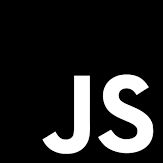

## The History of Me
So far I have had experience mostly with C and C++ with a little Python.  This semester in my ICS 314 class I will learn JavaScript and I am a little nervous.  During the summer I spent my days working with JavaScript, HTML, and CSS for an internship.  That sounds like I should have a good understanding but I do not!  I often used templates and set code that I tweaked to fit my needs for my project.  So, I really need to get back to the basics.

## Getting to know JavaScript
We are only on our second week of the semester but I learned so much already!  I remember seeing certain rules and syntax throughout my internship that I did not understand their purpose.  After going through a tutorial with JavaScript finally have a good foundation.  Some parts are very similar to other languages I worked with before.  For example, the really basic fundamentals such as using strings, math operators, and nested arrays.  However, I also saw features that are new to me.  Manipulating arrays with push() and pop() felt familiar because I worked with queues before but shift() and unshift() were surprising to me!  It feels so handy to have some of these functions available.  After going through the basics of JavaScript, I also went through a tutorial for ES6 which is a standard of JavaScript released in 2015.  There were so many new features to the language that I felt a little overwhelmed.  In particular, array functions were very interesting, yet confuse me sometimes because they can be simplified so much.  Another feature that I thought was useful was using * to import everything from a file.  During my summer internship I remember using import to get functions from files but I always had separate files for each function.  Now I know that if I were to have many functions in a file, I can just use * to import all of them.

## Is JavaScript as Good as They Say?
At first I thought JavaScript would just be another programming language, but there are many features that make it stand out.  For example, when you declare functions, you do not have to state what datatype it will return.  This means that one function can return a whole variety of datatypes like integers, floats, and characters.  Another interesting quality of this language is that functions are first-class objects.  Unlike other languages, JavaScript allows functions to be stored in an object, array, or variable.  It can also be passed as an argument into a function or even returned from a function.  At first this scared me because it has so many capabilities that I will not be able to keep track but I am sure that over time I will learn how to utilize all of these aspects of JavaScript.

## Let's Get in Shape!
As mentioned before, I am taking ICS 314 and in this class we go through athletic software engineering.  With this type of engineering, we learn by doing Workouts of the Day (WODs).  During these we are given a problem and we have a certain amount of time to solve it.  At first this made me stressed because timed tests always makes me nervous.  I am never sure if I can finish the questions on time.  However, I went through practice WODs and realized that it might not be so bad.  With practice WODs, we are given a problem and then try it on our own.  If we do not finish within the maximum time then we must stop and watch the tutorial given.  After that, we try again as many times as it takes for us to finish on time.  I think this is a good style of learning so far.  I learn best by doing and going through WODs really puts me to the test, although it still makes me nervous.  Although we have not gone through a real WOD yet, I think this learning style with work well for me.
