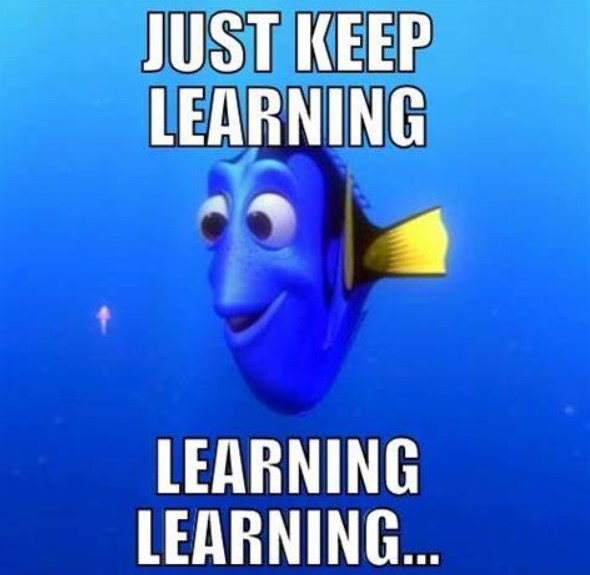

This semester I was able to take ICS 314 which is a class on software engineering.  Throughout these few months, I was able to learn about a variety of topics.  We covered concepts such as open source software development, configuration management, functional programming, coding standards, agile project management, ethics in software engineering, and so much more.  All of these can be applied to not just software engineering but other aspects of life.  Let us focus on just a few of these topics.

## Making Me Agile

Agile project management is a project management approach that utilizes breaking down projects into smaller tasks.  It focuses on having fixed-length iterations and releases, delivering business value early, continuous and adaptive planning, emergent feature discovery, and continuous testing.  Basically, you have short term goals that all work together towards the long term goal.  Utilizing short spans of time allows a team to work in increments that aids in producing a product fast while providing flexibility if something needs to change.  Issue-driven project management is a type of agile project management where teams use tasks that take no longer than a few days to complete and groups of tasks are organized into milestones.  Each task is an issue that is assigned to a specific person.  However, that person does not have to be the sole contributor to the task.  In my ICS 314 class, we used issue-driven project management through GitHub.  We created issues for each milestone and put them in the to do list.  From there, we all had one task each in progress at all times.  Whenever we completed an issue, we could close it and put it in the done section.  This way, we all know who is doing what at all times.  Outside of web development, this way of organizing a team would be very useful and I will continue to use this strategy whenever I need to get anything large done.

## Consider My Standards

Another concept covered in this class was coding standards.  I never heard of them before but I learned to love them.  Coding standards define how code should be formatted.  When all of your code looks the same, it makes finding mistakes easier.  It also allows other programmers to read and understand someone else’s code.  Although there are many resources that help scan your code to see if it fits a standard, in my class we used the IDE (integrated development environment) IntelliJ IDEA. With this, you can set up ESLint which is a tool to enforce coding standards.  At first I thought using ESLint was just tedious because it would keep giving me errors.  However, once I got used to writing code that follows the coding standards, I learned that it allows for better readability which in turn helps you find mistakes in your code much faster.  Aside from software engineering, we use standards in general in many different aspects of life.  For example, when we read articles, they usually follow a standard such as MLA format.  This format also seemed tedious at first when I was learning it in grade school.  However, I realized that whenever I come across something that does not follow a standard, it is really hard to read.  I feel like I enforce some sort of standard throughout anything I do in life.  Even with wrapping presents, I usually do it the same way every time.

## Farewell

After completing this course, I am grateful for all it has taught me.  Not only have I learned concepts such as Javascript, functional programming, HTML, CSS, and application design, but also how to manage and work as a team.  Although this course was challenging at times, I appreciate what it has introduced me to.  I hope to continue my learning in software engineering as time goes on.
