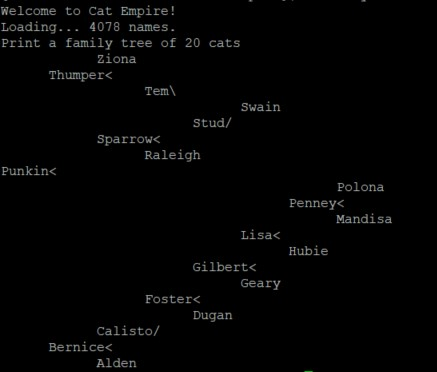

For this project, we were tasked to create and display a list of cats in various ways.  Collection classes are containers for objects.  For this lab we used two classes to create our cat empire.  The first class includes all of the data, keys, and structure for each cat.  The second class manages the data in a binary search tree that holds all of the cats.

The final result of this lab allowed us to print the list of cats in various ways.  We could print a family of cats by using a depth first search in order reverse.  With this, we could print out the tree visually as a left-to-right tree.  Then, we also printed a pedigree of cats to show the relationship of the cats in a different way.  This used depth first search preorder.  Another way we could display the cats is by generation.  This also used depth first search with a queue.  Finally, we listed the cats alphabetically using depth first search in order.

After completing this lab, I showed my knowledge of pointers, binary search trees, and tree traversal.  It was hard at first because there were so many files and functions to keep track of but in the end I was able to finish it.

[My Code Here](https://gitlab.com/bmhm/ee205-lab09-cat-empire)
