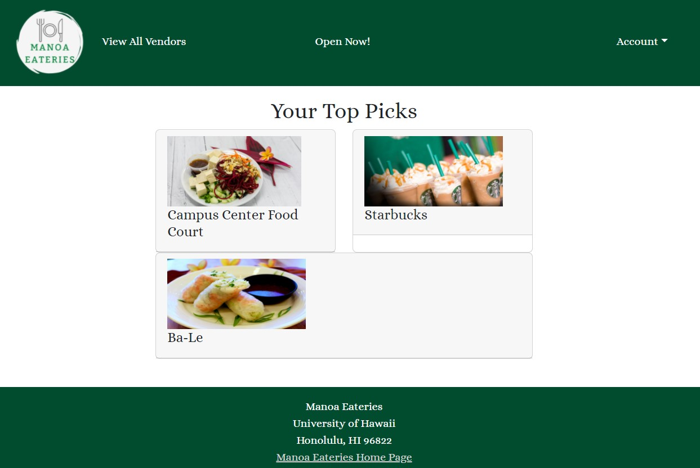
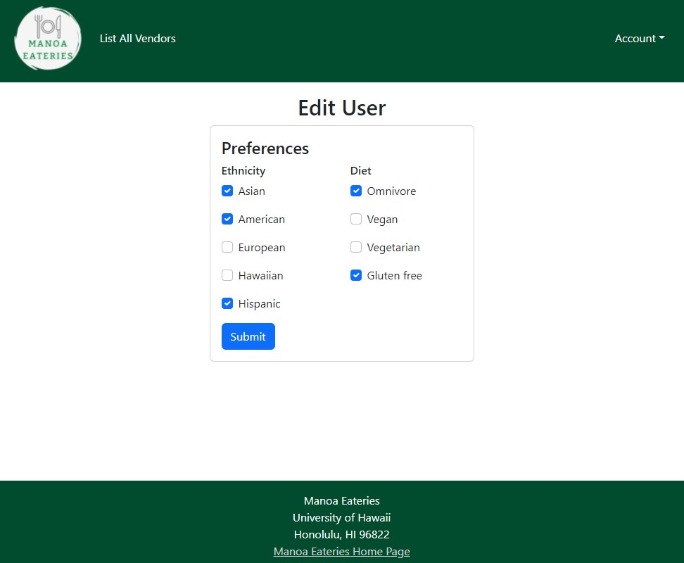

This was a final project for my ICS 314 class.  We worked in groups and my group decided to create a website that allows students to see what is available to eat on campus.  It provides a tool for UH community members to find what places are open and fit their dietary preferences.  

Below you can see some screenshots of the website.  Anyone can see the list of participating vendors.  However, if a user signs in, they also have the option to see just a few eateries that are open at the time.  There are regular users, vendors, and admin.  Users and vendors can edit their profiles as well.

**List All Vendors Page**

**Special Picks Page**

**Edit User Profile Page**

**Edit Vendor Page**

Throughout this project I worked on the landing page, creating the schema and publications, list all vendors page, and special picks page.  I also contributed to the organization page whenever needed.  With this, I learned more about how to use the skills I gained in this class to create something usable and helpful.  The concepts that I gained more experience in include Meteor, React, and Bootstrap.  Not only did this project test my skills in web development, but also project management.  I learned how to use GitHub issues and projects to utilize issue-driven project management.  Using this form of management allowed me to keep track of what needed to be done.  Overall, this project helped me solidify the skills introduced to me throughout this course. 

You can learn more about our website on our [Organization GitHub Page](https://manoa-eateries.github.io/)
