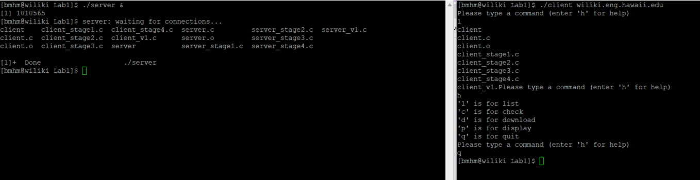

In this lab assignment we gained experience with the client server paradigm, processes, system calls, how data is transported over the internet, and communication between processes.  I did not have much experience with clients and servers at this time so this lab was a good introduction to the topic.  I was very lost at first but in the end I was able to complete the tasks given along with a teammate.

Our client was able to continually accept commands until the user quits.  The different commands were list the contents of the directory of the server, check if the server has the file name specified, download a file specified, and quit.

This lab was very helpful for me because it helped me gain a better understanding of how a client and server talk to each other.  I also learned to be cautious of zombie processes.

[My Code Here](https://github.com/brookemaeda/EE367ServerClientLab.git)
